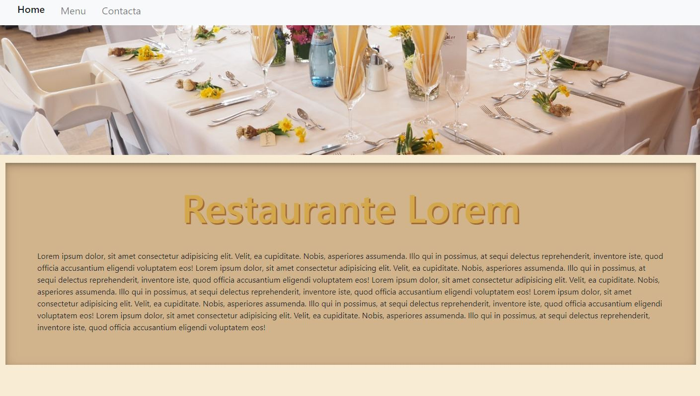
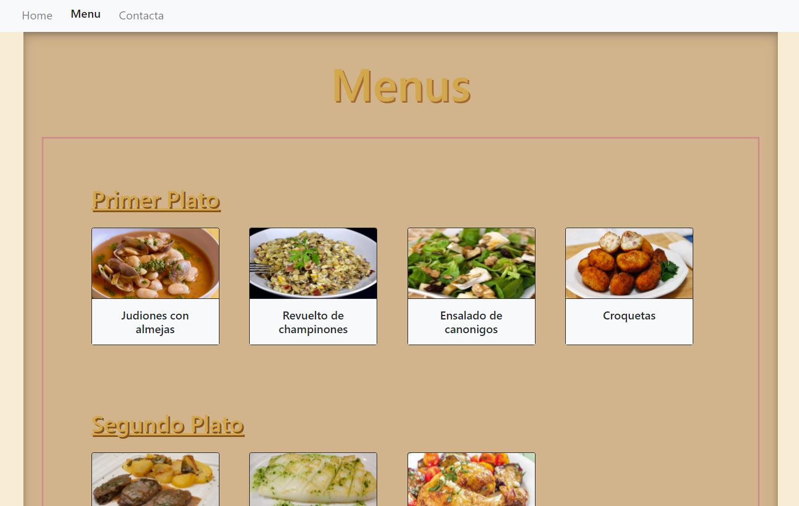
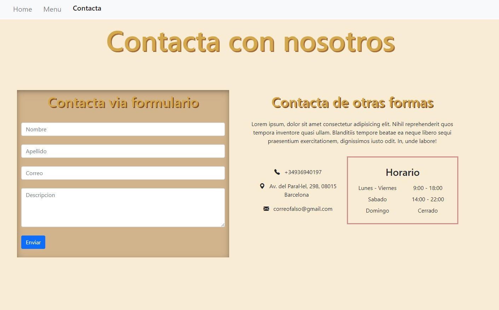

# Proyecto-carta-restaurante

Este proyecto trata de hacer una web para presentar un restaurante.

&nbsp;

## Demostración
***
[Ver pagina](https://saya85.github.io/proyecto-carta-restaurante/)

### HOME PAGE


### MENU PAGE


### CONTACT PAGE



## Tecnologias y recursos
***
Tecnologias utilizadas 
* [HTML](https://developer.mozilla.org/es/docs/Web/HTML/Element/html)
* [CSS](https://developer.mozilla.org/es/docs/Web/CSS)
* [Bootstrap](https://getbootstrap.com/)
* [Pexels](https://www.pexels.com)

&nbsp;

## Instalación 🔧
***
Para descargar el repositorio a tu maquina local, obten la URL del repositorio y utlizando la terminal pon este comando:

```
git clone "URL_REPOSITORIO"
```

### Pre-requisitos 📋

```
 - Instala un IDE.
 - Instala git en tu sistema operativo.
```
&nbsp;
## Despliegue 📦
***

A la hora de desplegar la web utilizamos gitHub Pages. Deployando el repositorio.

&nbsp;

## Construido con 🛠️
***

* [GitHub Pages](https://pages.github.com/)

&nbsp;

## Autores ✒️
***
* **Saya Casino Vidal** - *Trabajo Inicial y Documentación* - [Saya85](https://github.com/Saya85)
* **Rafael Garcia Perez** - *Trabajo Inicial y Documentación* - [Rafael3994](https://github.com/Rafael3994)

&nbsp;

## Licencia 📄

Este proyecto está bajo Licencia.